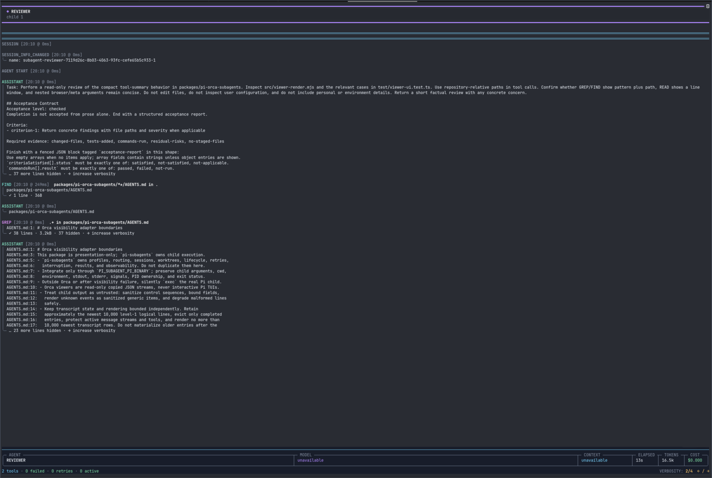

# pi-orca-subagents

A read-only live viewer for [`pi-subagents`](https://github.com/nicobailon/pi-subagents)
children inside Orca. Watch prompts, reasoning, tools, results, retries, usage,
and completion without giving the viewer control of the child.



_Captured from a real read-only `pi-subagents` reviewer child. The image is
cropped to the viewer surface; unrelated Orca workspace chrome is omitted._

**Why use it?** Delegated work stays observable, your current terminal keeps
focus, and `pi-subagents` remains the sole owner of execution.

## Ownership boundary

`pi-subagents` does all subagent work. It owns:

- agent profiles and model routing;
- foreground, background, parallel, and chained execution;
- sessions, worktrees, retries, interruption, and timeouts;
- lifecycle, progress, results, and `subagent_wait`.

This package registers no subagent-execution tools and bundles no agent profiles.
It primarily sets the public `PI_SUBAGENT_PI_BINARY` wrapper hook and, inside
Orca, conditionally exposes one presentation-only layout preference. The wrapper creates an
Orca terminal for visibility, then replaces itself with the real Pi process so
`pi-subagents` retains the child PID and complete lifecycle authority.

## Requirements

- Pi 0.81.x (tested with 0.81.0);
- `pi-subagents` 0.34.0 or newer, installed as a separate Pi package;
- Orca with a ready runtime when visible child logs are desired;
- Bash, Node.js 22.19.0 or newer, and the `orca` and `pi` commands on `PATH`.

## Installation

The two RogueKernel Pi extensions live in one shared Git repository. Clone it
once and register both package directories. `pi-orca-subagents` also requires
`pi-subagents`, installed here from its Git repository:

```bash
pi install https://github.com/nicobailon/pi-subagents
install_root="${XDG_DATA_HOME:-$HOME/.local/share}/roguekernel-pi-work"
git clone https://github.com/RogueKernel/roguekernel-pi-work.git "$install_root"
pi install "$install_root/packages/pi-copilot-context-variants"
pi install "$install_root/packages/pi-orca-subagents"
```

If the shared repository is already cloned for another package, skip the
`git clone` command.

`pi-subagents` is declared as an optional npm peer only to document compatible
versions. It remains a required Pi package and must be installed separately so
Pi loads its extension; this adapter does not bundle or duplicate it.

Restart Pi or run `/reload`.

Continue using the normal `subagent` tool and bundled `pi-subagents` profiles:

```text
Use reviewer to review the current diff.
```

Each Pi child launched by `pi-subagents` automatically gets a background Orca
terminal tab containing a readable, live view of its JSON event stream. This
default does not depend on the model calling an adapter tool. Assistant text,
thinking, tool calls, concise tool results, retries, errors, and completion are
rendered without exposing the raw protocol. Stderr is shown as a bounded warning.
Viewer creation does not move focus away from the current Pi terminal; click a
viewer in Orca when you want to inspect the child. Tabs use the title
`-> <agent> · <one-based child index>` when `pi-subagents`
supplies that metadata, with `-> subagent` as the fallback. The adapter records
each viewer's stable `ptyId` and current Orca metadata, so it can find the viewer
again after layout changes and close it when the child exits.

## Read-only viewer

The viewer follows the private stdout and stderr logs in one process. It presents
the launch manifest and chronological transcript without opening the child's
stdin or taking over its signals.

Controls:

```text
←/→                 verbosity 1–4
↑/↓, J/K, PgUp/PgDn transcript scroll
Home/End             top / bottom-follow
P                    prompt manifest
Q, Ctrl-C            close viewer only
```

The four verbosity levels apply to the whole transcript:

| Level | Narrative and prompts | Tool result lines |
| --- | --- | --- |
| 1 Compact | first 5 logical lines | 0 |
| 2 Readable | first 15 logical lines | 1 |
| 3 Detailed | uncapped | 5 |
| 4 Full | uncapped | uncapped |

Long sessions stay responsive through a rolling presentation window. The model
retains approximately the newest 10,000 logical transcript lines, evicting only
completed entries. Active messages and tool calls remain until they finish.
When older history is removed, the transcript begins with a stable marker such
as `… 12,430 earlier logical lines omitted`; token, cost, tool, failure, retry,
context, and elapsed-time metrics still cover the child's full observed
lifetime. The terminal renderer independently caps wrapped transcript output at
10,000 rows, so narrow windows and full verbosity cannot rebuild an unbounded
layout. Masthead, prompts, and the status dock are outside that row budget.

A viewer-imposed cap ends with the exact hidden logical-line count and the
`→ increase verbosity` hint. Source truncation is labelled separately; the
viewer never presents unavailable source content as complete. Full mode still
strips terminal controls.

`P` opens the same prompt rows shown at launch. Prompt layers stay in application
order and include their factual source and provenance when supplied by the
versioned manifest. The execution-specific task is distinguished from fixed
prompt layers by an amber `◆ TASK / USER PROMPT` heading and structural rail in
both views. Missing system, project, template, extension, task, model,
context, cost, run, or tagline data is omitted or marked unavailable rather than
guessed.

The footer reports observed identity, model, elapsed time, token and cost totals,
context use, tool calls, failures, retries, active calls, and the current level.
Context percentage is computed from the observed used and limit values. The dock
uses measured wide, medium, and narrow layouts, and the palette adapts to light
or dark terminal backgrounds.

Routine turn-boundary events, duplicate tool-call streams, and empty narrative
placeholders are omitted from the presentation. Unknown events render as sanitized
generic timeline items. Malformed JSON and stderr render as bounded warnings. When
terminal UI startup is unavailable, or
stdout is non-interactive, the same model is rendered as deterministic sanitized
text instead of delaying or failing the child.

Inside Orca, the adapter exposes the presentation-only `orca_subagent_view` tool
for two explicit exceptions to that default:

- `right_stack` requests the first viewer beside the current Pi terminal and the
  second below it. The adapter never steals focus: until Orca exposes a public
  non-focusing split capability, or on any unsupported version, these viewers
  safely remain background tabs. Additional or unidentifiable children also use
  background tabs.
- `hidden` suppresses viewers for the next `pi-subagents` launch.

The preference persists across turns and `subagent` management calls such as
`action: "list"`. It is consumed only by the next actual subagent launch and
then resets to background tabs. The tool does not create subagents or
general-purpose Orca terminals. Requests to create, split, or stack ordinary
working terminals should use Orca's terminal tools directly; those terminals are
outside this adapter.

Outside an Orca-managed terminal, the adapter does nothing: it does not register
the presentation tool, add model instructions, install the wrapper, show
notifications, or alter child execution. If Orca visibility
setup later fails inside Orca, the wrapper silently replaces itself with the
real Pi child without redirection. Arguments, cwd, environment, streams,
signals, and exit status then behave as if this adapter were not installed.

Copied stdout and stderr are best-effort presentation data, not the transport
of record. Each copied stream is capped at 8 MiB by default; after the cap or a
log-write failure, the relay keeps draining and forwarding the child's original
stream unchanged. Oversized logical records and retained warning payloads have
separate memory bounds and are explicitly labelled `source truncated`.

For constrained environments, set `PI_ORCA_CAPTURE_LIMIT_BYTES` to a positive
byte count before launching Pi. This changes only copied viewer logs.

## Important limitation

The Orca terminal is a **read-only Pi TUI**, not the child's interactive Pi
session. `pi-subagents` launches children in JSON/print mode with stdin disabled.
The adapter renders copied event streams while preserving the raw stdout protocol
for `pi-subagents`. Viewer keys only navigate or close the copied view; they never
send input or control signals to the child.

Forked and fresh-context children use the same `->` prefix. The public wrapper
seam does not currently expose a reliable context-mode marker, so the adapter
does not guess from session arguments.

One logical subagent run may open more than one terminal when `pi-subagents`
performs model fallback attempts, because each attempt is a separate Pi child.

## Existing wrapper configuration

If `PI_SUBAGENT_PI_BINARY` is already set, this package does not overwrite it
and shows a warning. Remove the existing override before reloading Pi if you
want this adapter to be active.

Set `PI_ORCA_REAL_PI_BINARY` only when the real Pi executable is not the `pi`
command found on `PATH`:

```bash
export PI_ORCA_REAL_PI_BINARY=/absolute/path/to/pi
```

## Uninstall

```bash
pi remove "${XDG_DATA_HOME:-$HOME/.local/share}/roguekernel-pi-work/packages/pi-orca-subagents"
```

Restart Pi afterward. Reloading alone cannot remove the wrapper path from the
current process environment. Removing this adapter does not affect
`pi-subagents` or its profiles.

## Development

See [docs/development.md](docs/development.md).
